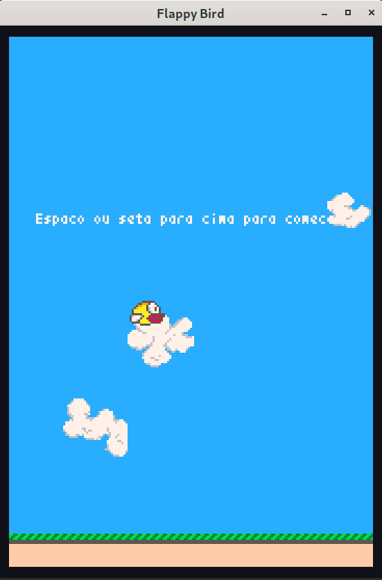
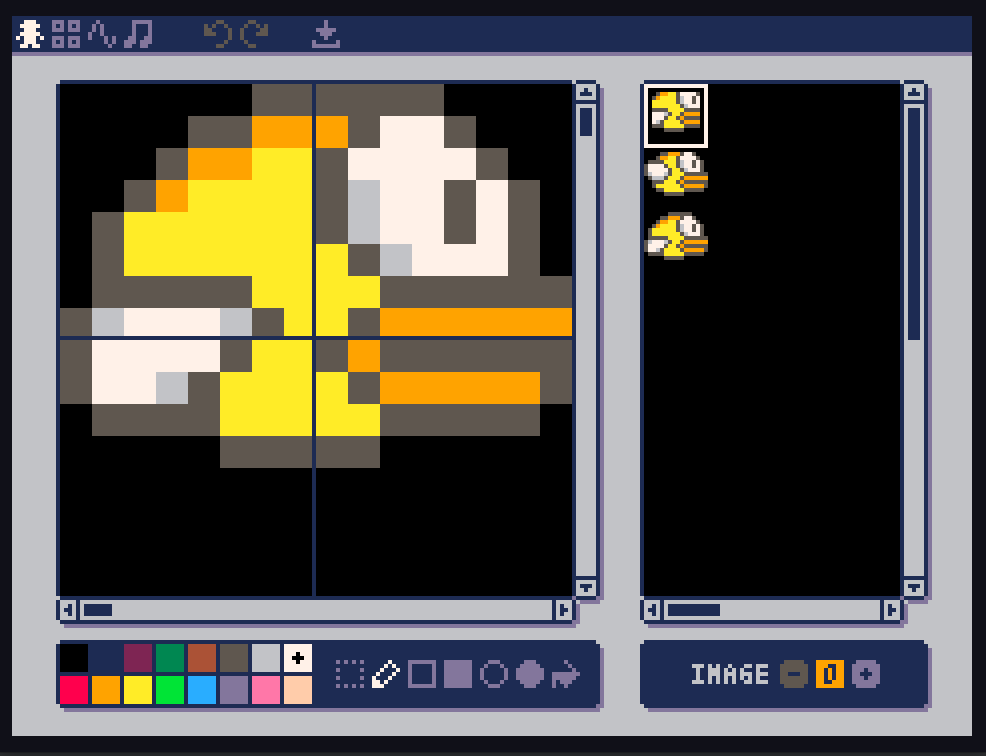

Arquivo com o esqueleto do tutorial

# STEAM POWER FOR GIRLS - Links e outras informações

- [Instagram das Pyladies](https://www.instagram.com/pyladiesdf/): @pyladiesdf
- [Avaliação do treinamento](https://forms.gle/LKnbbhRaxVyAEL9t9): por favor, preencham! Nos ajudará muito para melhorar esse e outros treinamentos! <3
- [Formulário de dúvidas](https://forms.gle/zm5Uns9vAcoKpkNM9): para ser usado nos dias seguintes ao treinamento quando tentarem fazer esse tutorial reduzido ou o tutorial completo
- [Tutorial completo](https://github.com/pyladiesdf/flappy-tutorial/blob/master/README.md): tutorial completo do treinamento

Quer participar das PyLadies, receber notícias sobre nossos eventos, bater papo ou tirar dúvidas sobre qualquer coisa?? Entre no nosso grupo do Telegram! Mande o [nome do seu usuário](https://www.techtudo.com.br/dicas-e-tutoriais/noticia/2015/04/aprenda-mudar-o-nome-e-foto-do-telegram.html) por mensagem privada no nosso Instagram!


# Hello World!

Bem-vinda ao Tutorial do Flappy Bird das Pyladies! Estamos felizes em vê-la aqui :) Este tutorial é uma
pequena viagem pelo mundo da programação. Vamos entender um pouco como os programas que governam nossos
computadores funcionam usando um método muito direto: criando nosso primeiro programa de computador!

Como todas as coisas desconhecidas, isto vai ser uma aventura - mas não se preocupe! Já que você teve 
coragem para estar aqui, você vai ficar bem :)

## Flappy Bird

Neste tutorial, vamos criar um joguinho estilo Flappy Bird e aprender o suficiente de programação 
para que você tenha independência para modificar o jogo e consiga criar outros joguinhos
diferentes do zero. A notícia boa é que com apenas alguns poucos conceitos, podemos
criar uma infinidade de novos jogos, programas de computador, websites etc. Conhecer os blocos básicos
da programação nos leva bem longe. É lógico que nem sempre é fácil: programação é
um desafio constante e mesmo programadores e programadoras experientes de vez em quando
encontram dificuldades inesperadas, ou pegam becos sem saída, abordagens
mal planejadas, etc. Esses obstáculos fazem parte da diversão e são como um quebra-cabeça: 
se for muito fácil e previsível, logo perdemos o interesse.

Nosso tutorial segue um caminho um pouco diferente de outros tutoriais de programação. Isso porque
**não** vamos montar nosso Flappy Bird da base até o topo. A abordagem é inversa: começamos com um 
módulo que possui uma versão completa do jogo e vamos abrir, desmontar, entender e, aos poucos, 
substituir cada pedaço por código que nós mesmas criamos. No fim do tutorial, sobrará apenas o 
nosso código e este módulo auxiliar poderá ser descartado.

No meio do caminho, vamos brincar com os parâmetros do jogo, inventar novas regras, mudar as cores
e fazer todo tipo de coisa estranha. Esperamos que, ao terminar o tutorial, todas tenham o conhecimento
necessário para começar um novo projeto do zero e a se desafiar. Será que você consegue fazer um jogo
como o [Pong](https://pt.wikipedia.org/wiki/Pong) do zero? Quais regras do Flappy Bird você alteraria? 
Pensa em outros efeitos visuais? Você tem uma idéia para criar um jogo que ninguém fez? E que tal um web site? 
Um aplicativo de celular? Um algoritmo de aprendizado de máquina? Enfim, o objetivo do tutorial é abrir 
a caixa de Pandora, o resto é com você!


## Ambiente de programação

Programação é uma mistura de criatividade com técnica. Pense como faz um artista ou artesão: criatividade é muito
importante, mas a técnica é necessária para usar os instrumentos corretamente e obter o efeito desejado. 

O instrumento básico de um programador é o editor de código. É onde escrevemos e lemos o código dos 
nossos programas. Cada linguagem de programação exige algumas ferramentas adicionais. No caso do Python, 
precisamos de um interpretador de Python instalado na máquina. Este é um programa que lê código Python 
e executa as instruções encontradas. Por fim, dependendo do projeto, precisamos de instalar alguns módulos
ou programas adicionais. No nosso caso, vamos instalar o Pyxel, que é uma espécie de extensão do Python (em
linguagem de programador, uma "biblioteca") que permite a criação de joguinhos retrô, estilo 8-bit. (Alguém 
aqui já jogou Atari, ou isso é velho demais?) 

Vamos à lista de recursos que devemos preparar antes de começar:

- [Python 3.7+](http://python.org/): O interpretador do Python. Precisamos instalar a versão 3.7 ou superior.
- [Visual Studio Code](https://code.visualstudio.com/): O editor de código. É uma escolha pessoal, mas 
  se você não conhece nenhum editor de código, o Visual Studio Code (ou VSCode, para os íntimos), é um 
  ótimo ponto de partida: grátis, leve, simples de usar e cheio de recursos.
- [Pyxel](https://github.com/kitao/pyxel): Biblioteca para criar joguinhos 8-bit em Python.
- [Módulo auxiliar flappy.py](https://raw.githubusercontent.com/pyladiesdf/flappy-tutorial/master/flappy.py):
  Módulo auxiliar que usaremos nesse tutorial. Possui a implementação 
  completa do jogo que vamos substituir pela nossa ao longo do tutorial.
- [Arquivo de imagens data.pyxres](https://raw.githubusercontent.com/pyladiesdf/flappy-tutorial/master/data.pyxres):
  Arquivo com as imagens em pixel art utilizadas no jogo. Possui o 
  desenho de um passarinho, canos, nuvens, terreno etc. Podemos editar este arquivo pixel a pixel utilizando
  o editor de imagens que vem incluído no Pyxel. 

Se você ainda não possui estes recursos instalados, siga um dos tutoriais abaixo, a depender do
sistema operacional no seu computador:

- Eu uso o [Windows](https://github.com/kitao/pyxel#windows).
- Eu uso o [Linux](https://github.com/kitao/pyxel#linux).
- Eu sou chique e uso o [MacOS](https://github.com/kitao/pyxel#mac).

# Tutorial, Parte 1: Iniciando o jogo 

Agora que temos tudo preparado, vamos começar com o nosso tutorial. O primeiro passo é criar uma pasta
onde vamos guardar nosso projeto e abrir o Visual Studio Code nesta pasta. Nosso projeto começa vazio e 
precisamos criar um arquivo contendo o código fonte e copiar alguns arquivos auxiliares.

O primeiro passo é ir para a pasta do projeto e copiar os arquivos 
[flappy.py](https://raw.githubusercontent.com/pyladiesdf/flappy-tutorial/master/flappy.py) e 
[data.pyxres](https://raw.githubusercontent.com/pyladiesdf/flappy-tutorial/master/data.pyxres) para a pasta do projeto. 
Ao lado destes dois arquivos, crie um arquivo vazio chamado `jogo.py` usando a função 
`Arquivo > Novo Arquivo` (ou Ctrl+N) no VSCode. Vamos abrir este arquivo e começar a trabalhar.

## Executando o jogo

Abra o arquivo `jogo.py` e copie e cole as duas linhas abaixo:

```python
import flappy

flappy.comecar()
```

A primeira linha diz para o Python importar o módulo auxiliar flappy, que irá nos ajudar ao longo
deste tutorial. Já a segunda linha, `flappy.comecar()` manda o Python executar a função
`comecar` definida dentro deste módulo. Em programação, uma função é uma espécie de maquininha: quando pedimos
para executá-la, o computador realiza uma série de instruções ao final pode retornar um resultado ou 
realizar um conjunto de ações. Neste caso, a função `comecar` simplesmente executa o jogo.

A primeira parte deste comando, `flappy.comecar` representa o nome completo da função dentro do programa. Algo como
`sobrenome.nome` da função, já que todas funções que começam com o mesmo prefixo `flappy` fazem parte do mesmo 
módulo. Já os parênteses após o nome da função dizem para o Python que queremos executá-la sem passar nenhum 
parâmetro adicional (os parâmetros adicionais, se existissem, ficariam entre os parênteses).

Com estas duas linhas, criamos o jogo completo. Simples, né? 

Claro que não! Um programa de computador tipicamente funciona em camadas. Criamos funções que
executam operações simples, depois juntamos estas funções para criar operações um pouco mais complexas,
que juntamos em outras funções ainda mais elaboradas e assim por diante. No caso do nosso jogo, a `flappy.comecar` 
esconde uma enorme complexidade: esta função executa outras funções que, entre outras coisas, desenham o
estado do jogo na tela, atualizam a posição dos elementos, verificam colisões, etc. A função de desenhar pode 
chamar outras funções responsáveis por operações mais simples
como, por exemplo, desenhar somente o passarinho, ou desenhar os canos. Estas, por sua vez, podem chamar funções
ainda mais fundamentais que manipulam pixels específicos na tela e interagem com o sistema 
operacional, placa de vídeo e outros detalhes de baixo nível. 

Nós não vamos descer o buraco até o nível mais 
fundamental dos bits: se puxarmos o fio de qualquer programa de computador trivial, iríamos nos deparar com um
conjunto imenso de milhões de linhas de código feitas por milhares de programadoras e programadores do
mundo inteiro ao longo de décadas e que lidam com detalhes altamente técnicos do funcionamento da memória,
processador e outros dispositivos. É muita coisa para qualquer um acompanhar! Mas vamos descer o suficiente para
que as novas habilidades sejam úteis: que você consiga criar novos jogos, pensar em novos projetos e personalizar
o Flappy Bird para ele funcionar exatamente do jeito que você deseja! 

Podemos executar o nosso programa `jogo.py` diretamente no VSCode. Basta abrir um terminal clicando
no menu `Terminal > Novo Terminal` (ou Ctrl+Shift+') e digitar a seguinte instrução: `python jogo.py`. Você deve
ver uma janela parecida com esta:



Aproveita a chance e tenta quebrar o seu recorde do Flappy Bird ;-)


## Variáveis

A função `flappy.comecar` analisa seu código procurando por várias dicas de personalização. Podemos
redefinir funções para controlar aspectos específicos do jogo (por exemplo, como desenhamos o passarinho),
mas o jeito mais simples de interagir é modificando variáveis de configuração.

Em Python, podemos criar uma variável simplesmente usando a notação `<nome-da-variável> = <valor>`. Assim,
é possível escrever variáveis entre as linhas `import flappy` e `flappy.comecar()` e, caso o nome da variável
seja reconhecido pelo módulo flappy, seu valor irá influenciar a execução do jogo.

Modifique o arquivo `jogo.py` para ficar mais ou menos como abaixo:

```python
import flappy

largura_tela = 150
altura_tela = 255
gravidade = 1.0
pulo = 8.0

flappy.comecar()
```

Os números mostrados são os valores padrão de cada uma destas variáveis. Modifique estes números para 
ver o que acontece. Você verá o tamanho da tela se alterar e a gravidade funcionando de modos estranhos. 
As variáveis que terminam com `.0` aceitam valores quebrados 
como, por exemplo, `gravidade = 0.75` e até valores negativos. **Importante:** os valores da tela 
devem estar entre 0 e 255.

Você também pode criar a variável que quiser no programa, (ex.: `numero_preferido = 42`), mas, a 
não ser que a variável tenha um nome reconhecido pelo módulo flappy, ela ainda não terá efeito algum.
Existem algumas pequenas limitações a respeito do nome. Nomes válidos de variáveis podem conter letras,
números e o "underscore" `_`. Um nome também não pode começar com um número ou conter espaços ou 
hífens em qualquer posição.

**Dica:** o lado direito de uma definição de variável pode ser uma expressão matemática como, por exemplo,
`pulo = 16 / 2`. O Python reconhece as 4 operações fundamentais e outras operações um pouco mais avançadas como
exponenciação, resto da divisão, entre outras.


# Tutorial, Parte 2: Desenhando na tela

Ao calibrar os valores das variáveis, podemos controlar apenas alguns aspectos básicos do jogo.
Agora é hora de abrir o brinquedo, ver o que tem dentro e mexer nas engrenagens. Vamos começar com a
primeira função importante, que é desenhar os elementos do jogo na tela: o céu, nuvens, o passarinho, 
os canos, etc. 

Para fazermos isto, é necessário aprender como se cria novas funções. Com isso, vamos trocar
a função responsável por pintar a tela pela nossa própria versão personalizada. Vimos que para chamar uma 
função, basta escrever o nome da mesma e abrir e fechar um parênteses no final (como em `flappy.comecar()`).

O módulo flappy entende que se você criar uma função chamada `desenhar`, ele irá utilizá-la ao invés de usar a versão
padrão desta função. Podemos testar essa idéia definindo a variável `desenhar = None` no nosso código. O valor
especial `None` (que "nulo/nada" em português) representa situações onde queremos anunciar que uma determinada variável
ainda não possui um valor bem definido, ou que está em um estado inválido ou inconsistente. No nosso caso, 
se falarmos que a função desenhar é nula, estamos pedindo para o módulo flappy não fazer nada quando esta função
for chamada. Coloque a linha `desenhar = None` antes de iniciar o jogo e você verá que a tela permanece preta! 
 
Talvez este último experimento não tenha sido muito útil, mas no espírito de desmontar o brinquedo e depois
colocar as peças de volta no lugar, vamos ver como a função `desenhar` é definida no módulo
flappy:

```python
def desenhar():
    desenhar_fundo()
    desenhar_nuvens()
    desenhar_canos()
    desenhar_chao()
    desenhar_flappy()
    desenhar_instrucoes()
```

Muita coisa para explicar aqui! Primeiro, observe que a função desenhar chama várias outras funções aparentemente
responsáveis por desenhar partes diferentes do nosso jogo. `desenhar_fundo`, nuvens, canos, chao, flappy, etc, 
parecem ser responsáveis por lidar com cada um destes pequenos elementos. Nosso objetivo é recriar
todas estas funções, mas vamos com calma: existem alguns detalhes importantes dessa notação que precisamos
entender primeiro.

Note como a definição da função desenhar começa com um `def <nome-da-função>`, depois colocamos os parênteses e
um sinal de dois-pontos (`:`). Esta é a estrutura básica que usaremos para definir qualquer função em Python. 
Em seguida, aparece uma série de instruções alinhadas um pouco mais à direita. Estas instruções são o que chamamos
de **corpo da função** e representam a parte principal da definição. Uma função nada mais é que um jeito de
reaproveitar e dar um nome a um conjunto de instruções. No nosso caso, estamos mostrando
para o Pyxel quais instruções devem ser executadas a cada frame para desenhar as imagens na tela enquanto o jogo
estiver rodando.

Um outro detalhe importante que devemos levar em conta é o alinhamento destas instruções no código. Alinhamento (ou 
"indentação", no jargão de programadores) é como o Python entende quais intruções estão associadas a uma função
ou bloco de código e quais instruções seriam executadas diretamente no módulo. Portanto, tome **muito** cuidado
para deixar o alinhamento perfeito, caso contrário o programa pode executar instruções diferentes daquelas que 
você está imaginando. A recomendação é que após a linha `def <nome-da-função>():`, o bloco de instruções
abaixo fique alinhado com quatro espaços a direita. O editor de código facilita nossa vida e troca uma única tecla 
*tab* por quatro espaços no código. Ele mantêm o alinhamento (ou nível de indentação) de uma linha para outra, de
forma que não precisamos indentar manualmente todas as linhas. Estas pequenas coisinhas tornam nossa vida muito 
mais fácil quando usamos um editor especializado em código em comparação com um editor de texto genérico 
como o Word ou o Notepad. 


## Comentários

Comece copiando o código da função desenhar para o seu próprio arquivo `jogo.py`. Lembre-se que ele deve ficar **antes**
da instrução final `flappy.comecar()`, senão a nossa versão da função não terá sido definida quando o jogo 
começar e ele utilizará a implementação padrão.

Podemos conferir que a nossa função está sendo utilizada apagando algumas linhas. Por exemplo, se você apagar 
a linha `desenha_flappy()`, o jogo não mostrará o passarinho! Vai ficar estranho porque todo o resto funciona
normalmente: o jogo continua calculando colisões, contando pontos, simulando a gravidade, etc. Só não mostra o 
passarinho na tela, o que deixa muito mais difícil de jogar!

Você já deve ter visto que apagar as linhas não é muito prático se quisermos depois escrevê-las de volta. Um método
muito mais eficiente é utilizar comentários de código. Um comentário é simplesmente uma linha que é ignorada pelo
Python e é muito útil para desligar um pedaço de código ou escrever qualquer observação em Português puro. 
Trata-se, portanto, de uma parte do código lida apenas por humanos e que o computador ignora.

Em Python, os comentários são as linhas que começam com um `#`, como no exemplo

```python
def desenhar():
    desenhar_fundo()
    desenhar_nuvens()
    desenhar_canos()

    # Vamos apagar o próximo comando para ver o que acontece!
    # desenhar_chao()
    desenhar_flappy()
    desenhar_instrucoes()
```

Comentários são ótimos para explicar um trecho de código meio nebuloso ou para apontar para links ou outros
recursos que expliquem melhor o que está acontecendo.


## Desenhando o fundo

Habilite todas as instruções da função desenhar. A função mais simples de todas, e a que escolhemos para 
começar a refazer, é a `desenhar_fundo()`. Vamos criar a nossa própria versão, mas antes dê uma olhada 
na implementação padrão:

```python
import pyxel

def desenhar_fundo():
    pyxel.cls(12)
```

O comando `import pyxel` carrega o módulo Pyxel e na verdade deve ficar logo junto ao comando `import flappy`
no seu código principal (não tem diferença aparecer antes ou depois). Isto não faz parte da função, mas é só
uma preparação!

Olhando o corpo da função, vemos que ela tem uma única instrução: chamar a função `pyxel.cls` passando o
número 12 como único parâmetro entre parênteses. Este código misterioso na verdade executa uma instrução muito 
simples: `pyxel.cls` limpa a tela aplicando uma única cor em toda área do jogo. `cls` vem de *clear screen*, 
ou *limpar a tela* em inglês. O valor 12 é simplesmente o número que identifica esta cor e, por um acaso, 
corresponde ao azul celeste que estávamos utilizando. 

A parte mais importante aqui é entender como o Pyxel representa cores. Um computador moderno é capaz de 
desenhar milhões de cores distintas que representam praticamente qualquer cor reconhecida pelo olho humano. 
O Pyxel, por sua vez, simula um computador antigo daqueles que só conseguem representar uma quantidade 
muito limitada de cores, de pixels, de sons, etc. No caso das cores, temos apenas 16 possibilidades, que 
são identificadas pelos números de 0 a 15. A correspondência entre números e cores é dada pela imagem abaixo:


Agora que você sabe o que está acontecendo, mude o número para trocar a cor para outro valor. Quem sabe ficar com
um céu vermelho ou roxo?


### Opcional: efeito estroboscópico

Podemos usar a correspondência entre números e cores para fazer um efeito estroboscópico no fundo do jogo. A idéia
básica é alternar a cor a cada frame avançando o número de 1 em 1. Para fazermos isto, é necessário juntar duas
idéias simples: a variável `pyxel.frame_count` conta quantos frames de jogo já foram mostrados na tela e aumenta
em 1 a cada novo frame. Se fizermos algo como,

```python
def desenhar_fundo():
    pyxel.cls(pyxel.frame_count)
```

veremos o jogo na tela por uma fração de segundo e depois aparecerá uma mensagem de erro falando que não existe
uma cor com o valor 16. Rapidamente `pyxel.frame_count` atinge valores altos já que a taxa de atualização é cerca
de 30 frames a cada segundo.

Podemos consertar este problema usando alguma operação matemática que limita o número para um valor no intervalo
de 0 a 15. Uma maneira simples de fazer isto é usar o resto da divisão por 16. O resto é sempre um número entre 
0 e 15 (já que um resto 16 seria equivalente a aumentar 1 no resultado da divisão com resto zero). O resto da 
divisão de um número `n` pelo divisor `d` é representado em Python por `n % d`. A escolha do sinal de porcentagem
é um pouco curiosa neste contexto, mas é algo comum em programação. Nosso código final ficaria 

```python
def desenhar_fundo():
    pyxel.cls(pyxel.frame_count % 16)
```

Muito bom! Agora a não ser que alguém gostaria que os jogadores tenham dor de cabeça ou um ataque epiléptico. Talvez
seja melhor voltar para um valor fixo para a cor do fundo ;-)

**Dica:** Se você não se lembra o que é o resto, vamos refrescar a memória. Quando fazemos a divisão de dois números
inteiros, muitas vezes o resultado não é exato. O resto é justamente o quanto sobra com relação à divisão exata.
Por exemplo, 42 dividido por 16 vai dar duas vezes 16 sobrando 10. Daí dizemos que a divisão inteira de 42 por 16 
é igual à 2 com o resto 10. Em Python, `42 / 2` realiza a divisão fracionária (com o resultado 2.625), `42 // 16` retorna a
divisão inteira (no caso, 2) e `42 % 2` calcula o resto da divisão inteira (que nesse caso é 10).


## Desenhando figuras geométricas

Pintar o fundo inteiro de uma única cor é simples. Como fazemos para desenhar uma figura complexa feita de vários
pixels escolhidos a dedo por uma artista de pixel art? Vamos explorar estas questões olhando o que tem dentro da
função `desenhar_flappy`.

Começamos com um objetivo mais modesto que desenhar pixel art: vamos representar o passarinho do Flappy Bird
simplesmente como um retângulo. Veja o código abaixo:

```python
def desenhar_flappy():
    largura = 17
    altura = 13
    cor = 10
    pyxel.rect(flappy_x, flappy_y, largura, altura, cor)
```

A parte importante aqui é a função `pyxel.rect(x, y, largura, altura, cor)`. Esta função desenha um retângulo
na tela que começa no ponto de coordenadas x e y, com determinada largura e altura (também medidas em pixels) e
que possui a cor sólida especificada no último argumento (um número de 0 a 15, lembra?). Observe que numa função
que possui vários parâmetros, especificamos cada valor separando-os por vírgulas. O significado para a função 
depende da sua posição na lista de argumentos. Por exemplo, em `pyxel.rect` o primeiro argumento sempre diz respeito
à posição x onde o retângulo começa, o segundo define a posição y do retângulo e depois largura, altura e cor.

Você também pode ter percebido que as variáveis `flappy_x` e `flappy_y` não foram definidas no código. Na verdade,
podemos omití-las porque estas variáveis foram definidas pelo módulo flappy e ao omití-las estamos simplesmente utilizando 
os seus valores padrão. Usar variáveis não definidas seria normalmente um erro e quando criar um código Python do zero 
é importante tomar cuidado com isto.


## Sistema de coordenadas e cores

Uma imagem na tela do computador ou celular é formada por uma grade de vários pontinhos coloridos. Cada um destes
pontinhos é conhecido como um pixel (do inglês **pic**ture **el**ement, ou elemento da imagem). Quando criamos
nossas próprias imagens a partir de código, é natural usar *pixels* (ou seriam *píxeis*?) para medir tamanhos
e posições. É justamente isto que vamos fazer ao longo deste tutorial.

A biblioteca Pyxel usa pixels fictícios, já que o objetivo dela é emular um computador antigo com muito menos
recursos que os computadores modernos. Enquanto um computador antigo poderia ter uma resolução da ordem
de 320x240 pixels, computadores modernos tipicamente possuem algo próximo de 1920x1080. Se multiplicarmos 
os dois números, vemos que o segundo é quase 30 vezes maior que o primeiro. 

Além disto, um monitor moderno possui um controle muito preciso da cor de cada pixel. Você já deve ter ouvido 
falar do padrão RGB: este é o mecanismo típico que monitores e telas de TV usam para gerar as várias cores. No RGB, 
cada pixel é formado por um ponto de luz vermelha (**R**ed), outro verde (**G**reen) e outro azul (**B**lue). Se 
você tiver acesso a uma lupa potente ou microscópio, é possível ver os três pontos de cor distintos muito 
claramente. O monitor então controla a intensidade de cada uma destas três cores em cada ponto da tela para gerar
qualquer cor distinguível pelo olho humano.

Um computador moderno típico usa 256 intensidades de cada cor RGB em cada pixel, o que resulta em aproximadamente 16.8
milhões de cores distintas por pixel! O Pyxel, por sua vez, nos limita a somente 16 cores, o que equivale ao número de cores 
nos primeiros monitores coloridos dos primeiros computadores pessoais da IBM.

Agora que sabemos que as distâncias são medidas em pixels e as cores são representadas por números de 0 a 15, 
vamos ver como se identifica um ponto específico na tela. A idéia básica é que podemos encontrar um ponto contando
quantos pixels é necessário andar na direção horizontal e quantos na direção vertical para conseguir encontrar o 
ponto no qual estamos interessados.

Em notação matemática usual, usaríamos o número de pixels a partir do canto esquerdo da tela como  
coordenada horizontal (coordenada **x**) e o número de pixels a partir da margem inferior para 
representar a coordenada vertical (coordenada **y**). Assim, x cresce para a direita e y para cima. 
Programadores gostam de complicar as coisas e contam a
partir do canto superior esquerdo. Isto significa que a coordenada y é invertida com relação à direção usual: `y = 0`,
representa o canto superior da tela e, na medida que y cresce, caminhamos para baixo na tela do computador e não para cima.

O fato que a coordenada vertical y cresce para baixo significa que, muitas vezes, temos que fazer algumas
conversões. Para encontrar um ponto que esteja 10 pixels a esquerda da tela e 20 acima, teríamos que usar as 
coordenadas `x = 10` e `y = altura_tela - 20`. 


## Pyxeleditor

Pyxel nos ajuda a criar joguinhos retrô baseados em *pixel art*. Por enquanto, vimos como desenhar coisas simples:
como pintar a tela de uma única cor e desenhar retângulos. Poderíamos criar nossas artes em código, programando 
as cores de cada pixel manualmente e isto era mais ou menos a abordagem usada para criar os primeiros jogos 
eletrônicos. Considerando que mesmo a tela de computadores antigos tinha dezenas de milhares de pixels, podemos
ver facilmente que isto seria **muito** trabalhoso.

Vamos usar uma abordagem alternativa e executar o Pyxeleditor, que é uma espécie de Photoshop retrô que vem junto
com o Pyxel para editar *pixel art*. O arquivo de imagens padrão para o tutorial, [data.pyxres](https://raw.githubusercontent.com/pyladiesdf/flappy-tutorial/master/data.pyxres), já vem 
com o desenho do Flappy Bird, canos, chão e nuvens. Você pode modificá-los depois, mas não queremos exigir um 
grande talento artístico e domínio completo sobre os pixels para terminar este tutorial e portanto já deixamos
a arte quase pronta.

Pyxeledit é aberto a partir da linha de comando. Abra novamente o terminal (no menu `Terminal > Novo Terminal`)
e digite `pyxeleditor data.pyxres`. Deve abrir uma tela como esta



Aqui temos um editor simples que permite modificar as imagens disponíveis no jogo pixel a pixel. Você pode brincar
um pouco aqui, mudar a cor do passarinho, desenhar algum adereço, etc, mas podemos simplesmente utilizar as imagens
como estão.

Observe que no canto inferior direito da tela temos um contator escrito "Image - 0 +". Isto permite escolher qual
imagem vamos editar. O Pyxel aceita apenas 3 imagens distintas, ainda que em cada imagem podemos fazer diversos
desenhos diferentes. Cada imagem possui um máximo de 256 por 256 pixels e pode ser editada em blocos menores de
16 por 16. Veja que ao passar o cursor em um ponto da imagem, o editor mostra as coordenadas do pixel no
canto superior direito. Isto é muito útil quando precisamos selecionar quais partes da imagem serão mostradas em
cada parte do jogo.

Veja que a primeira imagem (Image 0) possui 3 variantes do passarinho. Preste bastante atenção: cada variante possui
uma posição ligeiramente diferente para a asa. Assim, se alternarmos entre as variantes, podemos obter a ilusão de
movimento.
 
Finalmente, para desenhar uma destas imagens na tela precisamos recolher algumas informações:

* **Posição x e y da imagem na tela do jogo.** Esta posição corresponde à posição que o pixel
  superior esquerdo da imagem terá na tela de jogo. 
* **O número da imagem (0, 1, ou 2).** Escolhemos quais das 3 imagens do Pyxeledit será utilizada.
* **Posição u e v do pedaço da imagem que queremos no Pyxeleditor.** Corresponde ao ponto onde o pedaço da 
  imagem que estamos copiando começa no Pyxeleditor. Se a imagem estiver no canto superior esquerdo, este valor seria (0, 0). Caso 
  contrário, precisamos verificar as coordenadas no Pyxeleditor e utilizá-las no código Python para
  carregar estas imagens
* **Largura e altura.** Determina quantos pixels serão utilizados na direção horizontal e vertical
  a partir do pixel de início no Pyxeleditor.
* **Cor de máscara.** Podemos, opcionalmente, marcar uma das cores como sendo transparente. Deste modo,
  ao invés de desenhar os pixels desta cor, o Pyxel irá simplesmente manter o que já estava desenhado
  no fundo da tela.

Agora voltando para o código Python, podemos usar estas informações e passar para a função `pyxel.blt` para
desenhar uma imagem que se encontra no Pyxeleditor dentro do seu jogo. A função `blt` utiliza os parâmetros
mencionados acima (nesta mesma ordem) e seu uso é ilustrado abaixo

```python
def desenhar_flappy():
    # Número da imagem
    img = 0
    
    # Posição inicial no Pyxeleditor
    u = 0
    v = 0
    
    # Tamanho da imagem
    largura = 17
    altura = 13
    
    # Cor tratada como transparente
    mascara = 0

    # Chamamos a função blt para desenhar tudo isso!
    pyxel.blt(flappy_x, flappy_y, img, u, v, largura, altura, mascara)
```

Note que trocamos `x` e `y` por `flappy_x` e `flappy_y` já que estas são as variáveis que guardam as posições x
e y do passarinho. Para trocarmos a imagem, precisamos alterar o valor de u e v na chamada de função. Por exemplo, 
para usar a segunda imagem do passarinho com a asa para cima, faríamos `v = 16`, já
que é onde esta imagem começa na coordenada y. Altere um pouco estes valores para entender como cada um
funciona!


## Animando o Flappy Bird

Agora que sabemos como mostrar uma imagem na tela, vamos dar um passo além e criar uma animação! Vimos que na
imagem 0 do Pyxeleditor temos 3 versões do passarinho que diferem entre si pela posição das asas. Se alternarmos
entre estas três figuras, podemos criar uma ilusão de animação em que vai parecer que o passarinho está batendo
asas. 

A idéia é ficar apenas alguns poucos frames em cada uma das imagens e depois trocar por outra. Felizmente, 
as imagens são muito parecidas e estão próximas entre si, diferindo apenas pela posição inicial em y. Temos
a primeira imagem começando em `y = 0`, depois a seguinte em `y = 16` e a última em `y = 24`. Cada um destes casos
pode ser escrito simplesmente como `y = 0 * 16`, `y = 1 * 16` ou `y = 2 * 16`, de forma que apenas o número
que multiplica o 16 precisa mudar de uma imagem para a outra. 

Vamos supor que este número fica salvo na variável `frame`, para apontar o número do frame. Podemos modificar
o código anterior para trocar o frame que será mostrado na tela:

```python
def desenhar_flappy():
    # Fixamos o frame 
    frame = 0
 
    # Posição inicial no Pyxeleditor agora depende do frame escolhido
    u = 0
    v = frame * 16

    # O resto continua como antes...
    img = 0
    largura = 17
    altura = 13
    mascara = 0
    pyxel.blt(flappy_x, flappy_y, img, u, v, largura, altura, mascara)
```

Note que isto não resolve o problema da animação. Simplesmente alternamos a imagem do Flappy Bird entre
a que ele fica com a asa levantada (`frame = 1`) e as que ele fica com a asa abaixada (`frame = 0 ou 2`).
Para animarmos, é necessário avançar esta variável a cada frame ou a cada grupo de alguns poucos frames. 
Podemos fazer isto facilmente igualando `frame` ao `pyxel.frame_count`, mas tomando o resto da divisão por
3 para obter um número entre 0 e 2.

Troque a linha `frame = 0` por:

```python
frame = pyxel.frame_count % 3
```

Isto funciona, mas o passarinho bate asas **muito** rápido! Um modo fácil de acalmar este ritmo frenético é dividir
`pyxel.frame_count` por um valor qualquer antes de calcular o resto para dimuinir a taxa de alternância
entre as imagens. Algo como:

```python
frame = (pyxel.frame_count / 4) % 3
```

Este código deveria alterar a imagem a cada 4 frames, mas ao invés disto produz um bug de visualização muito estranho
(rode para ver!). O problema aqui é que frame deve ser sempre uma variável inteira e `pyxel.frame_count / 4`
pode resultar em valores fracionários. Consertamos isto trocando a divisão usual expressa como `a / b` pela
divisão inteira `a // b`, que garante que a resposta final é sempre um número inteiro. Juntando tudo isso,
ficamos com o código:


```python
def desenhar_flappy():
    # Escolhemos qual dos 3 frames 0, 1 ou 2 utilizar
    frame = (pyxel.frame_count // 4) % 3

    # Número da imagem
    img = 0
    
    # Posição inicial no Pyxeleditor
    u = 0
    v = frame * 16
    
    # Tamanho da imagem
    largura = 17
    altura = 13
    
    # Cor tratada como transparente
    mascara = 0

    # Chamamos a função blt para desenhar tudo isso!
    pyxel.blt(flappy_x, flappy_y, img, u, v, largura, altura, mascara)
```
 
Maravilha! Agora nosso passarinho aparece em toda glória do pixel art com direito a animação e tudo. E o 
mais importante de tudo isso: o código para fazer isto aparecer é todo seu!


## Desenhando os canos

O Flappy Bird mostra uma lista aparentemente infinita de canos andando para esquerda junto com o cenário. Esta
lista infinita, na verdade, é uma mentira! Na realidade, são apenas 4 canos que andam para esquerda e são
reciclados na medida que saem pelo lado da tela. Cada cano também é representado apenas por 2 valores:
a coordenada x com a posição horizontal e a coordenada y que determina a altura dos canos para verificar 
as colisões.

A lista de canos está salva na variável `canos`. Esta é uma variável do tipo lista, que contêm
vários valores diferentes dentro dela. Existem muitas operações que podemos fazer em listas, mas vamos aprender
apenas algumas das mais básicas. 

A primeira delas é a de ler um elemento da lista: listas são indexadas a partir do zero. Assim, o primeiro
elemento é representado por `canos[0]`, o segundo por `canos[1]` e assim por diante. Note que usamos os
colchetes para especificar a posição na lista. Para extrair as coordenadas x e y de um dos canos basta fazer:
 
```python
x, y = canos[0]
```

Aqui podemos trocar o índice de 0 para qualquer valor até 3 e escolher o cano adequado. Podemos
desenhar um cano inicialmente como um retângulo. Vamos nos preocupar só com o primeiro deles, por enquanto.

```python
abertura_cano = 200

def desenhar_canos():
    cor = 11
    largura = 25
    altura = 135
    x, y = canos[0]
    
    # Cano superior
    pyxel.rect(x, y, largura, altura, cor)
    
    # Cano inferior
    pyxel.rect(x, y + abertura_cano, largura, altura, cor)
```

Note que o código acima mostra apenas o primeiro cano da lista. Poderíamos copiar e colar as últimas linhas
alterando o índice de `canos[0]` para os valores 1, 2 e 3, mas isto não ficaria muito elegante. Se tem
uma coisa que o computador faz bem, é realizar tarefas repetitivas sem se cansar ou se confundir. 

Vamos ver um comando que permite fazer justamente isto. O comando **for** repete uma série de instruções alterando o valor
de uma variável em cada uma das repetições. A sintaxe do `for` é

```python
for elemento in lista:
    comandos que dependem de elemento
```

Este comando percorre uma lista de valores (no nosso caso queremos percorrer a lista de posições dos canos) e
executa uma ou mais instruções que dependem da variável associada a cada elemento da lista. Como cada elemento
na lista de canos é um par de variáveis, podemos separá-las diretamente no comando for:

```python
# Percorre a posição x, y de cada cano
for x, y in canos: 
    # Desenha o cano na posição x, y
    pyxel.rect(x, y, largura, altura, cor)
    pyxel.rect(x, y + abertura_cano, largura, altura, cor)
```

Juntando todos esses pedacinhos, podemos escrever a função responsável por desenhar os canos. Você consegue
fazer isto sozinha? Se esbarrar em alguma bug, não tem problema. Mostramos abaixo como pode ser o resultado
final. É lógico que esta não é a única (e nem necessariamente a melhor) maneira de se fazer.

```python
def desenhar_canos():
    cor = 11
    largura = 25
    altura = 135
    for x, y in canos:
        pyxel.rect(x, y, largura, altura, cor)
        pyxel.rect(x, y + abertura_cano, largura, altura, cor)
```

## Opcional: canos em pixel art

Um problema da implementação anterior é que os canos estão desenhados somente como retângulos sem graça. O
banco de imagens do tutorial possui uma versão desenhada com sombras e texturas em pixel art. A lógica é
muito parecida com o caso anterior, mas agora usamos a função `pyxel.blt` ao invés da função `pyxel.rect`.

Para usar `pyxel.blt`, precisamos indentificar a posição da imagem no banco de imagens e o tamanho em pixels
na altura e largura. Estes valores estão explicados no código abaixo:

```python
def desenhar_canos():
    img = 1       # índice da imagem (0 a 3)
    u = 0         # posição x no banco de imagens
    v = 0         # posição y no banco de imagens
    largura = 25  # largura em pixels
    altura = 135  # altura em pixels
    cor = 0       # cor considerada transparente ao desenhar a imagem (opcional)
    for x, y in canos:
        pyxel.blt(x, y, img, u, v, largura, altura, cor)
        pyxel.blt(x, y + abertura_cano, img, u, v, largura, -altura, cor)
``` 

Uma observação importante aqui: an segunda chamada a `pyxel.blt` usamos uma altura negativa. Isto simplesmente
diz para o Pyxel espelhar a imagem verticalmente. Se especificarmos uma largura negativa, ele espelharia no 
sentido horizontal. 

Este código pode ser reescrito de forma mais enxuta. Não é necessário definir `id = 1`, `u = 0`, `v = 0`, etc e usar 
o nome da variável na chamada de função. Podemos substituir os valores diretamente na posição dos argumentos e 
economizar várias linhas de código com isto. A chamada de função ficaria parecida com `pyxel.blt(x, y, 1, 0, 0, 25, 150, 0)`.
Usando este truque, com quantas linhas você consegue criar esta função?


# Lógica do jogo

Lembra da nossa função `desenhar` que chamava várias outras funções para desenhar partes específicas do jogo?
Vamos fazer algo parecido com a função `atualizar_jogo`, que atualiza partes específicas do nosso jogo e modifica
o valor de algumas variáveis dependendo de como o usuário interage com o jogo.

A implementação padrão desta função segue abaixo.

```python
def atualizar_jogo():
    atualizar_flappy()
    atualizar_canos()
    atualizar_colisoes()
    atualizar_score()
```

Nesse ponto você já deve entender como isto funciona. Esta função é executada no início de cada frame e realiza 
algumas tarefas em sequência: atualiza a posição e velocidade do passarinho, em seguida move os canos para a 
posição correta, testa se houve alguma colisão do passarinho com um cano ou com o chão e, finalmente, atualiza o
a pontuação do jogo se o jogador conseguir passar por mais um cano.

Você perceberá que estas funções tendem a ser um pouco mais complicadas que as funções de desenho. Isto não é 
necessariamente inesperado já que elas precisam fazer mais coisas e controlar a lógica do jogo. Elas também são
responsáveis por controlar as variáveis que controlam o estado do jogo como, por exemplo, a posição do passarinho,
sua velocidade, o número de pontos, etc. Todas estas tarefas exigem pequenos passos adicionais que vamos 
apresentar aos poucos nas próximas seções.


## Simulando gravidade

Vamos implementar as funções dentro de `atualizar_jogo` na ordem em que aparecem. A primeira delas, e talvez a
mais interessante, é a função de `atualizar_flappy`, que controla a posição do passarinho na tela. Esta função
controla basicamente 4 variáveis, que devemos declarar explicitamente agora antes de utilizá-las:

```python
flappy_x = largura_tela / 3
flappy_y = altura_tela / 2
velocidade = 0
morto = False
```

As variáveis `flappy_x` e `flappy_y` controlam as coordenadas (x, y) do passarinho na tela. `velocidade` se
refere à velocidade vertical onde valores positivos significa que o passarinho está caindo. Finalmente, a variável
`morto` pode assumir apenas os valores `True` (verdadeiro) ou `False` (falso) e diz se o passarinho está morto
ou não.

Lembre-se que quando fazemos `flappy_x = largura_tela / 3` é necessário que a variável `largura_tela` esteja 
previamente definida no código. Nossa sugestão é que você arrume o código para que as primeiras linhas sejam
todas de `import ...`, depois coloque as definições de variáveis, em seguida a definição de funções e, finalmente,
o código `flappy.comecar()` na última linha do seu programa.

Vamos começar simulando a gravidade no nosso jogo. A idéia básica é que a cada frame vamos aumentar a velocidade
por um incremento proporcional à gravidade e em seguida aumentar a posição em x de acordo com o valor da 
velocidade. Seria algo como fazer as transformações:

```python
velocidade = velocidade + gravidade
flappy_y = flappy_y + velocidade
```

Este código ficará dentro da função `atualizar_flappy`, então não copie para o seu arquivo ainda. Lembre-se
que em programação lemos o sinal `=` não como representando uma igualdade, mas sim como 
*"velocidade **recebe** velocidade mais gravidade"*. Isto significa que, ao executar esta linha o Python
calcularia o valor do lado direito (somando velocidade com a gravidade) e depois atualizaria a variável 
do lado esquerdo com o novo valor. O fato do mesmo nome aparecer dos dois lados da equação é um pouco
confuso, mas pense que cada lado opera em instantes diferentes de tempo: primeiro o computador avalia
o lado direito e somente *depois* de completar o lado direito que ele salva os valores nas variáveis do 
lado esquerdo.

Infelizmente, se simplesmente colocarmos este código dentro da função `atualizar_flappy` como abaixo,
o código não vai funcionar (o jogo trava logo no começo):

```python
def atualizar_flappy():
    velocidade = velocidade + gravidade
    flappy_y = flappy_y + velocidade
```

O problema aqui é bastante sutil e tem a ver com o que os programadores chamam de escopo de variáveis. Sempre que
criamos uma variável dentro de uma função o Python entende que esta variável só fica definida durante a execução
da função. Isto acontece mesmo quando existe outra variável com o mesmo nome definida anteriormente.

O primeiro tipo de variável (criadas dentro de uma função) é chamada de **variável local**. Recebem este nome
porque ficam disponíveis de forma localizada à função. Uma função **não** pode modificar as variáveis locais 
de outra e se duas funções usarem o mesmo nome para variáveis diferentes não acontece nada problemático na 
execução do programa. 

Por outro lado, as variáveis definidas fora de funções são as que chamamos de 
**variáveis globais**. Elas estão disponíveis globalmente para todas as funções, que compartilham os
mesmos valores de suas variáveis globais. Para evitar que as funções alterem o valor de variáveis
globais sem querer, o Python exige que nós declaremos explicitamente uma variável como global quando 
vamos modificá-la de dentro de uma função. Isto é só uma proteção para evitar que um código modifique uma 
variável que todos acessam de forma não-intencional. 

Dito isto, vamos modificar a nossa função de atualização para declarar flappy_x, flappy_y e velocidade
como globais (ou seja, se nós modificarmos estas variáveis dentro de uma função, ela será modificada 
globalmente).

```python
def atualizar_flappy():
    global velocidade, flappy_x, flappy_y

    velocidade = velocidade + gravidade
    flappy_y = flappy_y + velocidade
```

A instrução `global <nomes-de-variáveis>` especifica quais variáveis devem ser tratadas
como globais no corpo da função. Lembre-se que se a variável não for alterada dentro da função (ou seja, se 
estivermos utilizando-a somente para leitura, não é necessário fazer a declaração global.

**Observação para nerds:** quem se lembra bem das aulas de física pode perceber que as fórmulas estão erradas. Isto porque tomamos alguns
atalhos. Em física, a velocidade incrementa com a aceleração *multiplicada pelo intervalo de tempo* (e de forma análoga
para a posição), o que faz com que a fórmula correta seja `velocidade = velocidade + gravidade * dt`  e `flappy_y = flappy_y + velocidade * dt`.
No caso, estamos assumindo que o intervalo de tempo `dt = 1`. Isto não é correto se estivermos medindo tempo em
segundos, mas funciona se estivermos medindo em frames. Para nós, dt é realmente igual a um já que em jogos é comum
medir a posição em pixels, a velocidade em pixels por frame e aceleração por pixels por frames ao quadrado!   


## Pulos e interação com o teclado

Estamos progredindo, mas o jogo agora tornou-se impossível de progredir: começamos uma partida e o passarinho simplesmente
cai sem nenhuma chance do jogador fazer qualquer ponto. Temos que verificar se o jogador realizou um
comando de pulo e, neste caso, alterar a velocidade do nosso Flappy Bird. 

Para fazer isto, é necessário articular duas verificações: primeiro, descobrir se uma determinada tecla foi 
pressionada ou não (no nosso caso o espaço ou a seta para cima). Depois, modificar a velocidade *somente se* 
esta tecla estiver pressionada no frame atual. 

A primeira parte é feita pela função `pyxel.btnp(<tecla>)`. Podemos selecionar a tecla usando uma de várias
variáveis presentes no módulo Pyxel. Todas variáveis que representam teclas possuem nomes da forma 
`pyxel.KEY_<nome-da-tecla>`. Por exemplo, `pyxel.KEY_A`, `pyxel.KEY_B`, etc representam letras. Já `pyxel.KEY_UP`,
`pyxel.KEY_DOWN`, `pyxel.KEY_LEFT` e `pyxel.KEY_RIGHT` representam as setas do teclado. Os nomes estão em inglês,
mas geralmente são o que se espera para cada uma das teclas.

Podemos, assim, criar uma variável `pulando` que guarda um valor de verdadeiro ou falso dependendo se alguma tecla
de pulo estiver pressionada ou não:

```python
pulando = pyxel.btnp(pyxel.KEY_SPACE)
```

O código acima testa somente a tecla de espaço. Podemos verificar mais de uma tecla criando uma expressão lógica.
Temos um pulo se o jogador *apertar o espaço **OU SE** apertar a seta para cima*. Em inglês **ou** se escreve como 
**or** e a expressão lógica ficaria traduzida para Python como

```python
pulando = pyxel.btnp(pyxel.KEY_SPACE) or pyxel.btnp(pyxel.KEY_UP)
```

Agora temos a variável `pulando` que diz se o passarinho deve pular ou simplesmente cair de acordo com a lei da
gravidade. Caso esteja pulando, devemos mudar a direção do movimento para cima, alterando o valor da velocidade.
Este tipo de regra *se condição A for satisfeita, então faça ação B* é conhecido como uma execução condicional
em programação. Colocamos isto no nosso código criando blocos condicionais com o comando **if**. Algo como o código
abaixo.

```python
if pulando:
    velocidade = velocidade_de_pulo  # escolhemos a velocidade do pulo
```

A estrutura geral do comando **if** é `if <condição>: <bloco-de-instruções>`, onde o bloco de instruções pode conter
várias linhas de comandos. A condição pode ser qualquer valor, variável ou expressão que represente um valor 
verdadeiro ou falso. No nosso caso, vamos simplesmente utilizar o valor da variável `pulando`, que sabemos que 
deve ser `True` ou `False`, dependendo se o usuário tiver ou não pressionado as teclas de pulo.

Lembra que o sistema de coordenadas do Pyxel considera que a coordenada y cresce na medida que andamos para baixo na tela?
Assim, uma velocidade positiva significa que o objeto está caindo e uma velocidade negativa representa um objeto subindo.
A variável pulo, que representa a velocidade de cada pulo do Flappy Bird é um valor positivo, então devemos inverter seu
sinal ao modificar a velocidade, efetivamente trocando `velocidade_de_pulo` por `-pulo`.

Finalmente, temos que limitar a posição y do passarinho para que ele não ultrapasse o chão. A soma da altura da arte
do chão com a do passarinho dá 29 pixels, o que significa que ele deve estar pelo menos a 29 pixels de distância da 
parte inferior da tela. Em outras palavras, a posição máxima em y deve ser `altura_tela - 29`. Podemos limitar isto
utilizando um condicional. Algo como *se posição maior que altura máxima, então posição recebe altura máxima*.

Juntando tudo isso, ficamos com o seguinte código para atualizar o passarinho: 

```python
def atualizar_flappy():
    global velocidade, flappy_x, flappy_y

    pulando = pyxel.btnp(pyxel.KEY_SPACE) or pyxel.btnp(pyxel.KEY_UP)
    
    # Atualiza a velocidade
    velocidade += gravidade

    # Verifica se está pulando antes de atualizar a posição
    if pulando:
        velocidade = -pulo
        
    # Atualiza a posição
    flappy_y += velocidade
    
    # Limita altura
    if flappy_y > altura_tela - 29:
        flappy_y = altura_tela - 29
```

Muito bom! Agora nosso personagem cai e também consegue pular! Evite somente copiar e colar este código 
sem entender o que está acontecendo. Você consegue escrever a mesma lógica de um jeito diferente? 
Usando menos linhas ou trocando a ordem de alguns comandos? Existe alguma troca que altera
o funcionamento do código? Faça experimentos para entender bem o que está acontecendo. Se o experimento 
der errado, ctrl+z é sempre seu amigo :)


## Vivo ou morto?

No Flappy Bird, o passarinho começa vivo e consegue voar enquanto não tiver tocado em nenhum cano ou no chão. O módulo
auxiliar flappy define uma variável chamada `morto` que controla se o passarinho está morto ou não. É lógico que ele
só deve ser capaz de pular se `morto = False`. 

Por enquanto, não precisamos nos preocupar em determinar quando trocar `morto` de `False` para `True`, porque a implementação
padrão já faz isto para gente. Vamos apenas assumir que recebemos sempre o valor correto e vamos atualizar o passarinho de
acordo com isto. Existem duas mudanças que podemos fazer no nosso código: primeiramente, a de previnir pulos quando o
passarinho estiver no estado morto. Depois, fazê-lo andar junto com o cenário quando estiver caído no chão para que os
canos não continuem passando por ele.

A primeira parte é a mais fácil: basta trocar a condição `if pulando: ...` para `if pulando and not morto: ...`. No Python,
podemos fazer expressões lógicas de maneira muito parecida com o que elas seriam em inglês. A segunda condição lê-se como
***se** estiver pulando **e** **não** estiver morto, então atualize a velocidade*. 

A parte de deslocar o passarinho junto com o cenário vai exigir um condicional extra. Neste caso, vamos controlar o valor
da posição x e afastar 1 pixel por frame para esquerda caso o passarinho estiver morto. Esta velocidade de 1 pixel por
frame não foi escolhida à toa: é mesma velocidade com que o cenário se desloca no jogo. Algo como:

```python
if morto:
    flappy_x = flappy_x - 1
```

Tente fazer estas alterações por conta própria e veja o que funciona. Se travar, dê uma olhadinha na implementação 
abaixo ou use ela apenas para conferir se as suas alterações estão boas. Em programação, não existe uma única 
resposta correta. Se seu código estiver diferente, mas funcionando bem, então parabéns! Significa que você está 
encontrando seu próprio caminho e próprio estilo na programação :)

```python
def atualizar_flappy():
    global velocidade, flappy_x, flappy_y

    pulando = pyxel.btnp(pyxel.KEY_SPACE) or pyxel.btnp(pyxel.KEY_UP)
    
    # Atualiza a velocidade
    velocidade += gravidade

    # Verifica se está pulando antes de atualizar a posição
    if pulando:
        velocidade = -pulo
        
    # Atualiza a posição
    flappy_y += velocidade
    
    # Limita altura
    if flappy_y > altura_tela - 29:
        flappy_y = altura_tela - 29

    # Desloca-se com o cenário, caso esteja morto
    if morto:
        flappy_x -= 1
```

Ufa! Esta parte foi difícil, mas valeu a pena! Agora entendemos como o passarinho se move e obedece 
à Lei da Gravidade. 


## Score

Vamos finalmente implementar a última função da lógica do jogo, `atualizar_score`. Aqui nossa tarefa é relativamente
simples: temos que contar quantos canos já passaram pelo Flappy Bird. Para isto, basta ver a posição x de cada cano
e verificar se ela coincide com a posição do passarinho. Se elas coincidirem, sabemos que o passarinho acabou de 
passar por um cano e, se ele não estiver morto, isto significa que o score deve aumentar por um.

Lembre-se de declarar o valor inicial `score = 0` junto com as outras variáveis do jogo e em seguida crie
a função `atualizar_score`. A parte mais difícil aqui é percorrer a lista de canos. Vimos que cada cano
é representado apenas por um par (x, y) com a posição x do cano e a altura da sua abertura. Podemos
percorrer esta lista de valores usando o comando `for (x, y) in canos: ...`, onde o Python vai automaticamente
atribuir o primeiro valor do par à variável x e o segundo à variável y. 

Novamente, tente fazer as modificações por conta própria, mas se travar em algum ponto, mostramos uma
implementação possível da função `atualizar_score`.

```python
score = 0

def atualizar_score():
    global score

    # Percorre as coordenadas x e y de cada cano
    for (x, y) in canos:

        # Verifica se a posição do cano coincide com a do passarinho e se ele
        # não está morto
        if flappy_x == x and not morto:
            score = score + 1
```

Terminamos aqui a parte de atualizar a lógica do jogo e já podemos passar para a última parte do
tutorial.


# Finalizando

Esta é apenas uma versão reduzida do tutorial e já deu bastante trabalho! Incentivamos você a fazer 
o [tutorial completo](https://github.com/pyladiesdf/flappy-tutorial) para terminar a implementação 
de todas as funções e criar o jogo 100% por conta própria, sem a ajuda do arquivo auxiliar `flappy.py`.
Terminando isto, você ganhará independência para começar os primeiros projetos e os primeiros passos
nessa jornada incrível pelo mundo da programação! Até mais e bons códigos :)
